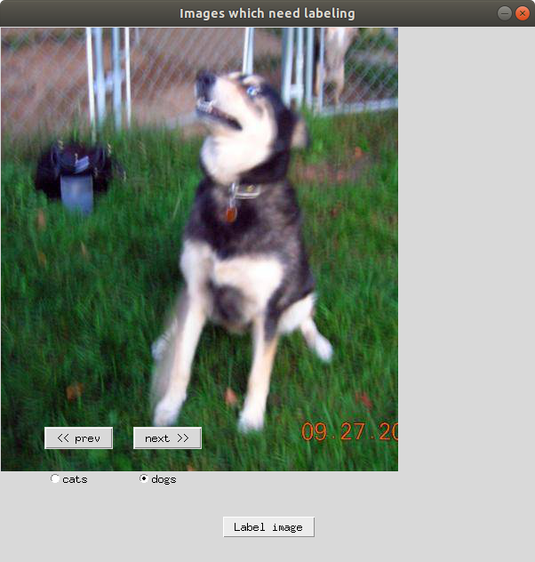

# CEAL_using_Tkinter

## 개요

논문) [Cost-Effective Active Learning for Deep Image Classification](https://arxiv.org/abs/1701.03551)

PyTorch로 CEAL 알고리즘을 구현하고, 사용자가 실제로 선택된 불확실한 샘플에 대해 레이블링을 수행하도록 Tkinter를 활용한 GUI를 제공한다. 이를 통해 제한된 비용으로 레이블링된 데이터를 단계적으로 획득하는 Active Learning을 이해해 본다.


## 실행 방법

 실행을 위해 필요한 파라미터들은 configuration.yml 을 통해 설정한다.  파라미터 설정 후 ceal 디렉토리 안의 main.py를 실행한다.

```shell
python ceal/main.py
```


## 프로젝트 상세 설명

### 데이터셋 구성

 이미 Annotator에 의해서 레이블링이 된 데이터셋 폴더(dl)와 레이블이 필요한 데이터셋(du)을 함께 처리할 수 있는 Custom dataset을 구성한다. 데이터셋을 생성할 때, boolean 변수인 labeled 값을 통해, 두 데이터셋을 구분하여 생성할 수 있다. 구체적인 레이블 명은 설정파일인 configuration.yml을 통해 전달할 수 있다. 단, 추가적인 경로 지정의 번거로움을 피하기 위하여, 레이블된 데이터셋의 폴더명과 전달하는 레이블 명이 동일하도록 유지한다. 

### CEAL의 hyperparameter 설명

- max_iteration : 사용자가 추가적인 annotation을 시행할 횟수
- criteria : CEAL에서 uncertain sample을 선택하는 방법( cl / ms / en)
- k : 각 시행에서 annotation을 위해 뽑을 uncertain sample의 갯수
- delta_0 : unlabeled data에서 certainty가 높은 high confidence sample을 뽑는 경계값
- dr : 기준 임계값의 감소율
- epochs : 레이블링 된 데이터와 high confidence sample을 가지고 모델을 훈련하는 에포크

### CEAL에서 사용하는 Uncertainty Sampling Strategy

1. Least Confidence(cl) : 특정 클래스에 대해 확률이 가장 낮은 데이터를 샘플링하여 레이블링 요청
2. Margin Sampling(ms) : 각 클래스에 대한 확률 간의 차이가 가장 작은 데이터를 샘플링
3. Entropy Sampling(en) : 엔트로피 값이 가장 큰 데이터를 샘플링

### 훈련 가능한 모델

 torchvision.models 패키지에서 호출할 수 있는 pretrained model을 ceal.py에서 데이터셋에 맞게 변형하여 사용한다. 현재는 AlexNet, ResNet18, Densenet161을 configuration.yml에서 "AlexNet", "ResNet", "DenseNet" 으로 지정하여 사용할 수 있도록 하였고, 나머지 모델도 동일한 방식으로 구현하여 사용할 수 있다.

### CEAL 워크플로우

1. 현재까지의 레이블링 된 데이터를 기반으로 모델을 학습시킨다. 
2. 학습된 모델로 레이블링이 필요한 uncertain sample을 뽑는다.
3. 뽑힌 uncertain sample은 labeling_scheduled 폴더로 이동된다.
4. labeling_scheduled의 데이터를 Tkinter로 구현된 레이블링 애플리케이션에서 레이블링한다.
5. 새롭게 레이블된 데이터와 기존의 레이블 데이터, 그리고 예측의 정밀도가 높은 high confidence data를 합쳐서 모델을 재학습시킨다. 단, CEAL에서 워크플로우가 다시 시작될 때, high confidence data는 레이블 되지 않은 데이터셋으로 다시 돌려보낸다.

## Tkinter를 활용한 labeling window

 


*참고)*

- [CEAL_keras](https://github.com/dhaalves/CEAL_keras)
- [PyTorch implementation of CEAL](https://github.com/rafikg/CEAL)
- [Pytorch[Basics] - Sampling Samplers](https://towardsdatascience.com/pytorch-basics-sampling-samplers-2a0f29f0bf2a)